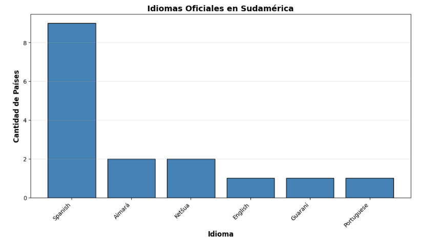
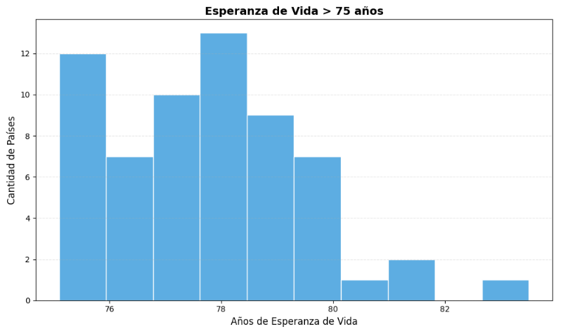
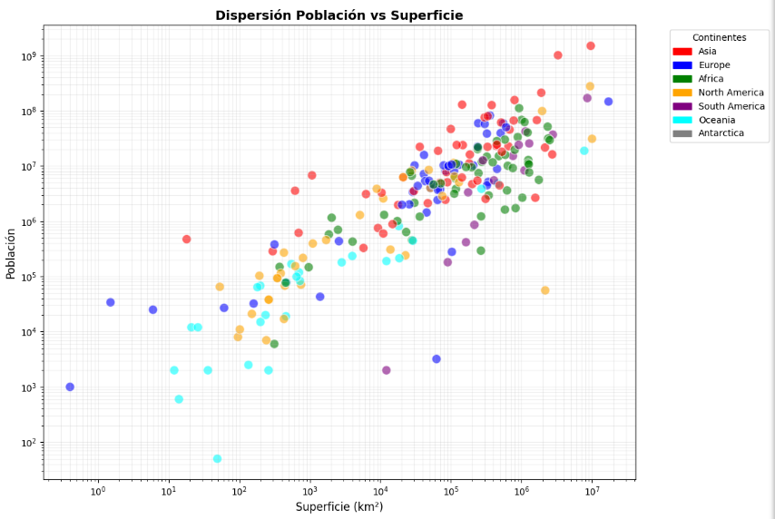

# 📊 Análisis Global de Datos: Salud, Urbanización e Inclusión

## 📌 Descripción

Proyecto de análisis de datos utilizando Python y SQL para explorar patrones globales relacionados con la esperanza de vida, la concentración urbana y la diversidad lingüística.

El objetivo es identificar factores clave que influyen en la calidad de vida, la distribución poblacional y los desafíos de inclusión en diferentes regiones del mundo.

---

## 🛠️ Herramientas utilizadas

* Python (Pandas, NumPy)
* Matplotlib
* SQL
* Jupyter Notebook

---

## 🔎 Análisis realizados

* Esperanza de vida por país
* Idiomas oficiales en Sudamérica
* Relación entre población y superficie
* Ciudades con más de 5 millones de habitantes
* Idiomas por continente
* Riesgo por concentración urbana (megaciudades)
* Fragmentación lingüística y riesgo de inclusión

---

## 📊 Visualizaciones

### Idiomas oficiales en Sudamérica

### Esperanza de vida > 75 años

### Relación población vs superficie

### Ciudades con más de 5 millones de habitantes

### Idiomas por continente

### Riesgo por megaciudades

### Riesgo lingüístico

### Fragmentación lingüística

---

## 💡 Insights principales

* Existen diferencias significativas en la esperanza de vida entre regiones.
* Algunos países presentan alta concentración de población en una sola ciudad, lo que representa un riesgo urbano.
* La diversidad lingüística puede generar barreras de inclusión social.
* El análisis permite identificar regiones con desafíos en salud, urbanización e inclusión.

---

## 📁 Archivos incluidos

* Notebook con análisis en Python y SQL
* Visualizaciones en formato imagen
* Dataset en formato SQL

---

## 🎯 Conclusión

Este proyecto demuestra cómo el análisis de datos puede apoyar la toma de decisiones en temas globales como salud, urbanización y diversidad cultural.
